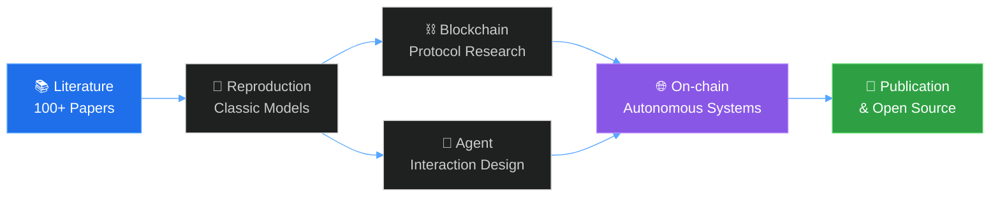

<h1 align="center">
  
</h1>

<p align="center">
  
  
  
</p>

<p align="center">
  <a href="mailto:zhangjinghan1122@bupt.edu.cn">
    
  </a>
  
  
</p>

---

## 🧭 `whoami`

```ts
const jinghan = {
  name:        "Zhang Jinghan (张靖瀚)",
  affiliation: "Beijing University of Posts and Telecommunications",
  major:       "FinTech · Senior Undergraduate",
  location:    "Beijing, China 🇨🇳",

  research: {
    primary:   ["Blockchain Systems", "Consensus Mechanisms", "DeFi Protocols"],
    secondary: ["LLM-based Agents", "Multi-Agent Interaction", "Agentic Workflows"],
    mission:   "Engineering trust — one block, one agent at a time.",
  },

  currentFocus: [
    "🔗 Cross-domain blockchain applications",
    "🤖 Intelligent agent architecture & human-agent interaction",
    "📚 Paper reproduction & systematic literature review",
  ],

  funFact: "Read 100+ papers. Reproduced most of the classics. Still hungry.",
};
```

---

## 🧪 Research Footprint

<table>
  <tr>
    <td width="50%" valign="top">
      <h3>⛓️ Blockchain Systems</h3>
      <ul>
        <li>Deep dive into <b>L1 / L2 architectures</b>, consensus design, and on-chain governance</li>
        <li>Hands-on exploration of <b>DeFi, ZK-proofs, and cross-chain protocols</b></li>
        <li>Mapping blockchain utility across <b>finance, supply chain, identity, and data markets</b></li>
      </ul>
    </td>
    <td width="50%" valign="top">
      <h3>🧠 Intelligent Agents</h3>
      <ul>
        <li>Designing <b>LLM-driven agents</b> with structured reasoning and tool use</li>
        <li>Researching <b>multi-agent coordination</b> and human-in-the-loop interaction</li>
        <li>Exploring the convergence of <b>on-chain agents × autonomous economies</b></li>
      </ul>
    </td>
  </tr>
</table>

<p align="center">
  
  
  
</p>

---

## 🛠️ Tech Arsenal

<p align="center">
  <strong>Languages</strong><br/>
  
  
  
  
  
  
</p>

<p align="center">
  <strong>Blockchain & Web3</strong><br/>
  
  
  
  
  
  
</p>

<p align="center">
  <strong>AI / Agent Stack</strong><br/>
  
  
  
  
  
  
</p>

<p align="center">
  <strong>Infra & Tools</strong><br/>
  
  
  
  
  
  
</p>

---

## 📊 GitHub Analytics

<p align="center">
  
  
</p>

<p align="center">
  
</p>

<p align="center">
  
</p>

---

## 🧭 Roadmap · 2026



---

## 📫 Let's Connect

Open to research collaborations, technical discussions, and thoughtful exchanges on **blockchain architecture**, **agent design**, or **anything at the intersection of the two**.

<p align="center">
  <a href="mailto:zhangjinghan1122@bupt.edu.cn">
    
  </a>
  <a href="https://github.com/ZhangJinHaHaHa">
    
  </a>
</p>

<p align="center">
  <em>"Code is law. Agents are the new citizens. Let's build the protocol."</em>
</p>

<p align="center">
  
</p>
